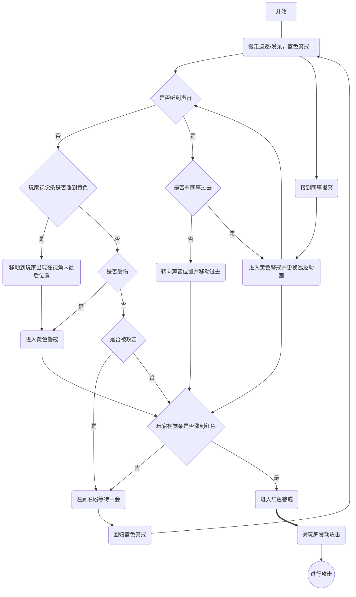
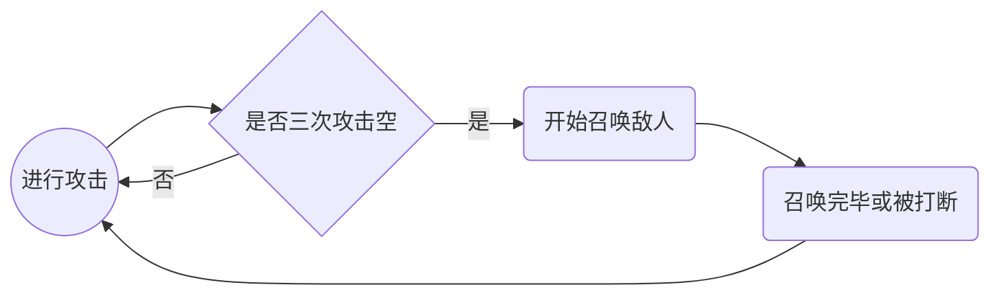

```mermaid
	graph TD
	开始  --- A
	A(慢走巡逻/发呆，蓝色警戒中) 
    A-->A2
    A2{是否听到声音}--否-->A22
    A2--是-->A23
    A23{是否有同事过去}--否-->A3
    A23--是-->B3
    A3(转向声音位置并移动过去)-->C
    A22{玩家视觉条是否涨到黄色}--是-->B1
    A22--否-->B
    A4(回归蓝色警戒)-->A
    A-->A5
    A5(接到同事报警)-->B3

	B{是否受伤}  --是--> B2
    B--否-->B4
    B2(进入黄色警戒) -->C
    B1(移动到玩家出现在视角内最后位置)-->B2
    B3(进入黄色警戒并更换巡逻动画)-->A2
    B3-->C
    B4{是否被攻击}--是-->C2
    B4--否-->C

    
	C{玩家视觉条是否涨到红色} --否--> C2
    C--是-->D
    C2(左顾右盼等待一会)-->A4

	D(进入红色警戒) ==> E
    E(对玩家发动攻击)-->F
    F((进行攻击))

``` 
	

```mermaid
    graph LR
    F((进行攻击))-->F2
    F2{是否三次攻击空}--是-->F3
    F2--否-->F
    F3(开始召唤敌人)-->F4
    F4(召唤完毕或被打断)-->F
    
```
